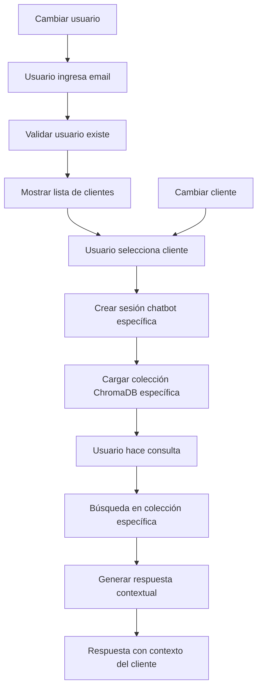
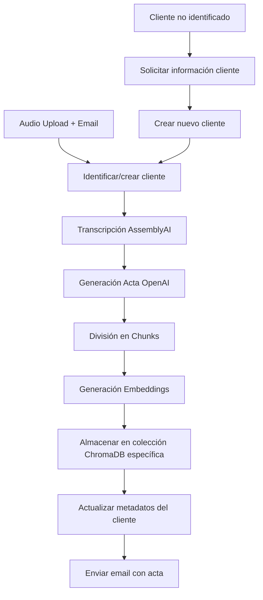

# 🚀 Plan de Implementación: Base de Datos Vectorial con Chatbot por Cliente

## 📋 Resumen Ejecutivo

Este documento describe el plan completo para implementar un sistema de base de datos vectorial con chatbot que permita a los usuarios consultar sus transcripciones organizadas por cliente. El sistema utiliza **SOLO ChromaDB** con persistencia local para almacenamiento vectorial y metadatos, eliminando completamente PostgreSQL para máxima simplicidad.

### Objetivos Principales

- ✅ Permitir consultas semánticas sobre transcripciones por cliente
- ✅ Aislamiento completo de datos por usuario y cliente
- ✅ Interfaz intuitiva de chatbot por cliente
- ✅ Integración seamless con el pipeline existente
- ✅ **Arquitectura simplificada**: Solo ChromaDB, sin PostgreSQL

## 🎯 Arquitectura del Sistema Simplificada

### Stack Tecnológico

- **Base de Datos Única**: ChromaDB con persistencia local
- **Embeddings**: OpenAI text-embedding-3-small
- **Chatbot**: OpenAI GPT-3.5-turbo
- **Framework**: FastAPI (existente)
- **Almacenamiento**: Persistencia local ChromaDB (elimina PostgreSQL)

### Principios de Diseño

- **Simplicidad Máxima**: Una sola base de datos para todo
- **Seguridad por Diseño**: Aislamiento completo de datos
- **Performance Optimizada**: < 100ms para búsquedas vectoriales
- **Escalabilidad Horizontal**: Colecciones por cliente
- **Costo Cero**: Sin infraestructura externa

## 📊 Esquema de Datos Simplificado

### Estructura en ChromaDB

```json
{
  "chromadb_structure": {
    "collections": {
      "naming_strategy": "{user_email}_{client_id}",
      "examples": [
        "consultor@empresa.com_uuid_cliente_abc",
        "consultor@empresa.com_uuid_cliente_xyz",
        "otro@empresa.com_uuid_cliente_def"
      ],
      "benefits": [
        "Aislamiento natural por usuario y cliente",
        "Búsquedas más rápidas en datasets pequeños",
        "Escalabilidad horizontal",
        "Seguridad por diseño"
      ]
    },

    "documents": {
      "id": "uuid_transcripcion_chunk_1",
      "text": "Fragmento de transcripción...",
      "vector": [0.1, 0.2, ...],
      "metadata": {
        "user_email": "consultor@empresa.com",
        "client_id": "uuid_cliente_abc",
        "client_name": "Empresa ABC S.A.",
        "transcript_id": "uuid_transcripcion",
        "filename": "reunion_presupuesto.mp3",
        "chunk_index": 1,
        "speaker": "Juan",
        "timestamp_start": "00:05:30",
        "timestamp_end": "00:07:45",
        "duration_minutes": 45.5,
        "assembly_cost": 0.20,
        "openai_cost": 0.002,
        "status": "completed",
        "created_at": "2024-01-15T10:30:00Z",
        "meeting_date": "2024-01-15T10:30:00Z",
        "topics": ["presupuesto", "recursos"],
        "importance_score": 0.8,
        "word_count": 287
      }
    }
  }
}
```

### Metadatos Enriquecidos por Cliente

```json
{
  "client_context": {
    "client_id": "uuid_cliente_abc",
    "client_name": "Empresa ABC S.A.",
    "extracted_insights": {
      "key_topics": ["presupuesto", "recursos", "timeline", "riesgos"],
      "decision_patterns": ["consenso", "jerárquico"],
      "communication_style": ["formal", "directo"],
      "pain_points": ["recursos limitados", "timeline ajustado"],
      "success_factors": ["comunicación clara", "planificación detallada"]
    },
    "meeting_summary": {
      "total_meetings": 12,
      "total_duration_hours": 8.5,
      "average_meeting_duration": 42.5,
      "last_meeting": "2024-01-15T10:30:00Z",
      "next_scheduled": "2024-01-22T14:00:00Z"
    }
  }
}
```

## 🔐 Sistema de Seguridad y Aislamiento

### Filtros de Acceso por Capas

```json
{
  "access_control": {
    "layer_1_user_isolation": {
      "description": "Usuario solo ve sus propias colecciones",
      "implementation": "Colecciones nombradas por user_email",
      "security": "Aislamiento natural en ChromaDB"
    },

    "layer_2_client_isolation": {
      "description": "Sesión de chatbot específica por cliente",
      "implementation": "Colecciones nombradas por user_email_client_id",
      "security": "Doble aislamiento usuario + cliente"
    },

    "layer_3_query_validation": {
      "description": "Validación de permisos en cada consulta",
      "implementation": "Verificar que user_email coincida con colección",
      "security": "Validación adicional en aplicación"
    }
  }
}
```

### Configuración de Persistencia ChromaDB

```json
{
  "chromadb_persistence": {
    "configuration": {
      "persist_directory": "./chroma_db",
      "collection_naming": "{user_email}_{client_id}",
      "distance_metric": "cosine",
      "embedding_function": "openai",
      "index_type": "hnsw",
      "hnsw_space": "cosine"
    },

    "persistence_settings": {
      "automatic_save": true,
      "backup_frequency": "daily",
      "retention_policy": "keep_all",
      "data_directory": "./chroma_db",
      "index_directory": "./chroma_db/index",
      "collections_directory": "./chroma_db/collections"
    },

    "performance_settings": {
      "batch_size": 100,
      "concurrent_requests": 10,
      "cache_size": "1GB",
      "memory_mapping": true,
      "compression": "lz4"
    }
  }
}
```

## 🤖 Sistema de Chatbot por Cliente

### Flujo de Sesión de Chatbot



### Tipos de Consultas Soportadas

#### 1. Consultas Específicas del Cliente

- "¿Qué se dijo sobre el presupuesto con ABC?"
- "¿Cuáles fueron las decisiones en la última reunión con ABC?"
- "¿Qué preocupaciones tiene ABC sobre el proyecto?"

#### 2. Consultas Comparativas (Mismo Usuario)

- "¿Cómo difiere el enfoque de ABC vs XYZ?"
- "¿Qué estrategias funcionaron mejor con ABC?"
- "¿Cuáles son los patrones comunes entre mis clientes?"

#### 3. Consultas Analíticas por Cliente

- "Resume la evolución del proyecto con ABC"
- "¿Cuáles son los riesgos principales con ABC?"
- "¿Qué acciones pendientes tengo con ABC?"

## 🔍 Sistema de Búsqueda Avanzado

### Estrategia de Retrieval

```json
{
  "search_strategy": {
    "vector_similarity": {
      "weight": 0.7,
      "description": "Búsqueda semántica principal",
      "implementation": "ChromaDB cosine similarity"
    },
    "keyword_matching": {
      "weight": 0.2,
      "description": "Coincidencia exacta de términos",
      "implementation": "Filtros de metadata"
    },
    "metadata_filtering": {
      "weight": 0.1,
      "description": "Filtros por fecha, participante, etc.",
      "implementation": "ChromaDB where clauses"
    }
  }
}
```

### Ranking de Relevancia

```json
{
  "relevance_scoring": {
    "semantic_similarity": "Similitud vectorial ChromaDB (0-1)",
    "keyword_density": "Frecuencia de términos clave",
    "temporal_relevance": "Proximidad temporal",
    "speaker_relevance": "Relevancia del hablante",
    "importance_score": "Score de importancia del chunk"
  }
}
```

## 📱 Experiencia de Usuario

### Flujo Completo de Usuario

```json
{
  "user_journey": {
    "landing_page": {
      "title": "Consulta tus Transcripciones por Cliente",
      "description": "Accede a todas las conversaciones organizadas por cliente",
      "cta": "Ingresa tu email para comenzar"
    },

    "client_dashboard": {
      "header": "Tus Clientes",
      "client_cards": [
        {
          "client_name": "Empresa ABC S.A.",
          "last_meeting": "Hace 2 días",
          "total_meetings": "12 reuniones",
          "total_duration": "8.5 horas",
          "status": "Proyecto activo"
        }
      ],
      "actions": ["Iniciar chat", "Ver historial", "Agregar cliente"]
    },

    "chatbot_session": {
      "header": "Chat con Empresa ABC S.A.",
      "context_info": {
        "client_name": "Empresa ABC S.A.",
        "project_type": "Desarrollo de Software",
        "relationship_duration": "6 meses",
        "last_meeting": "15 de enero, 2024"
      },
      "chat_interface": {
        "suggestions": [
          "¿Qué se discutió en la última reunión?",
          "¿Cuáles son los próximos pasos con ABC?",
          "¿Qué preocupaciones tiene ABC?"
        ]
      }
    }
  }
}
```

## 🏗️ Arquitectura Técnica Simplificada

### Estructura de Servicios

```json
{
  "service_architecture": {
    "user_service": {
      "responsibilities": [
        "Validar usuarios existentes",
        "Gestionar sesiones de usuario",
        "Control de acceso"
      ],
      "storage": "ChromaDB metadata"
    },

    "client_service": {
      "responsibilities": [
        "Gestionar clientes por usuario",
        "Crear/actualizar información de cliente",
        "Validar permisos de acceso"
      ],
      "storage": "ChromaDB metadata"
    },

    "vectorization_service": {
      "responsibilities": [
        "Vectorizar transcripciones por cliente",
        "Crear colecciones específicas",
        "Gestionar embeddings contextuales",
        "Mantener persistencia ChromaDB"
      ],
      "storage": "ChromaDB collections"
    },

    "chatbot_service": {
      "responsibilities": [
        "Procesar consultas por cliente",
        "Generar respuestas contextuales",
        "Mantener historial de sesión"
      ],
      "storage": "ChromaDB queries"
    }
  }
}
```

### Configuración de ChromaDB Detallada

```json
{
  "chromadb_configuration": {
    "persistence": {
      "directory": "./chroma_db",
      "automatic_save": true,
      "backup_frequency": "daily",
      "retention_policy": "keep_all",
      "data_integrity": "checksums"
    },

    "collection_settings": {
      "distance_metric": "cosine",
      "embedding_function": "openai",
      "index_type": "hnsw",
      "hnsw_space": "cosine",
      "hnsw_construction_ef": 200,
      "hnsw_search_ef": 50
    },

    "performance": {
      "batch_size": 100,
      "concurrent_requests": 10,
      "cache_size": "1GB",
      "memory_mapping": true,
      "compression": "lz4"
    },

    "metadata_structure": {
      "required_fields": [
        "user_email",
        "client_id",
        "transcript_id",
        "chunk_index",
        "timestamp_start",
        "timestamp_end",
        "created_at"
      ],
      "optional_fields": [
        "speaker",
        "importance_score",
        "topics",
        "sentiment",
        "word_count",
        "assembly_cost",
        "openai_cost"
      ]
    }
  }
}
```

## 🔄 Pipeline de Procesamiento Simplificado

### Flujo de Vectorización por Cliente



### Identificación Automática de Cliente

```json
{
  "client_identification": {
    "automatic_detection": {
      "from_transcript": [
        "Nombres de empresa mencionados",
        "Dominios de email en transcripción",
        "Referencias a proyectos específicos"
      ],
      "from_filename": [
        "Patrón: cliente_reunion_fecha",
        "Ejemplo: abc_presupuesto_2024.mp3"
      ],
      "from_metadata": [
        "Email del usuario",
        "Fecha de la reunión",
        "Duración y participantes"
      ]
    },

    "manual_assignment": {
      "when_needed": "Cliente no identificado automáticamente",
      "ui_component": "Selector de cliente en upload",
      "fallback": "Crear nuevo cliente"
    }
  }
}
```

### Estrategia de Chunking Inteligente

```json
{
  "chunking_strategy": {
    "division_criteria": {
      "natural_pauses": "Respeta cambios de tema",
      "speakers": "Mantiene contexto de conversación",
      "timestamps": "Preserva información temporal",
      "optimal_size": "250-400 palabras por chunk",
      "overlap": "50 palabras entre chunks para contexto"
    },

    "example_structure": {
      "transcript_5000_words": {
        "chunk_1": "Introducción (300 palabras)",
        "chunk_2": "Revisión Presupuesto (400 palabras)",
        "chunk_3": "Discusión Recursos (350 palabras)",
        "chunk_4": "Timeline y Cronograma (300 palabras)",
        "chunk_5": "Riesgos y Mitigación (400 palabras)",
        "chunk_6": "Conclusiones y Acciones (250 palabras)"
      }
    }
  }
}
```

## 📊 Métricas y Monitoreo

### Métricas de Performance

```json
{
  "performance_metrics": {
    "vectorization": {
      "time_per_transcript": "2-4 segundos",
      "chunks_per_minute": "~50",
      "success_rate": ">99%",
      "persistence_success": ">99.9%"
    },

    "search": {
      "query_response_time": "<100ms",
      "accuracy_score": ">85%",
      "user_satisfaction": ">4.0/5.0",
      "collection_load_time": "<50ms"
    },

    "chatbot": {
      "response_generation_time": "1-2 segundos",
      "context_relevance": ">80%",
      "conversation_completion_rate": ">70%"
    }
  }
}
```

### Métricas por Cliente

```json
{
  "client_metrics": {
    "engagement": {
      "queries_per_client": "Consultas por cliente/mes",
      "session_duration": "Tiempo promedio de sesión",
      "client_retention": "Clientes que regresan a consultar"
    },

    "content": {
      "transcripts_per_client": "Transcripciones por cliente",
      "total_duration_per_client": "Horas de conversación",
      "topics_per_client": "Temas más consultados"
    },

    "business_value": {
      "client_satisfaction": "Feedback por cliente",
      "project_insights": "Insights generados por cliente",
      "decision_support": "Decisiones apoyadas por chatbot"
    }
  }
}
```

### Métricas de Seguridad

```json
{
  "security_metrics": {
    "access_control": {
      "unauthorized_access_attempts": 0,
      "cross_client_access_prevented": "100%",
      "data_isolation_verified": "100%"
    },

    "privacy": {
      "user_data_isolation": "100%",
      "client_data_isolation": "100%",
      "query_logging_disabled": true
    },

    "persistence": {
      "data_integrity_checks": "100%",
      "backup_success_rate": ">99.9%",
      "recovery_time": "<5 minutos"
    }
  }
}
```

## 💰 Estimación de Costos Simplificada

### Costos Adicionales por Transcripción

- **Embeddings**: ~$0.0001 por 1K tokens (muy bajo)
- **Chatbot**: ~$0.002 por consulta (GPT-3.5-turbo)
- **Almacenamiento**: Gratuito (ChromaDB local con persistencia)

### Ejemplo de Costos Mensuales

- 100 transcripciones/mes: +$0.50
- 500 consultas/mes: +$1.00
- **Total adicional**: ~$1.50/mes

### Recursos Adicionales Necesarios

```json
{
  "additional_resources": {
    "disk": "~2MB por transcripcion (incluyendo vectores)",
    "ram": "~10MB por 100 transcripciones",
    "cpu": "~3% adicional durante vectorizacion",
    "persistence": "Backup automático diario"
  }
}
```

## 🚀 Plan de Implementación Simplificado (8 días)

### **Fase 1: Configuración ChromaDB** (1 día)

#### Día 1: Infraestructura Base

- [ ] Instalar ChromaDB con persistencia
- [ ] Configurar directorio de persistencia
- [ ] Crear estructura de colecciones
- [ ] Tests básicos de almacenamiento y recuperación

### **Fase 2: Servicios Base** (2-3 días)

#### Día 2-3: Servicios de Usuario y Cliente

- [ ] Crear UserService (validación de emails)
- [ ] Crear ClientService (identificación de clientes)
- [ ] Implementar detección automática de cliente
- [ ] Tests de servicios base

#### Día 4: Servicio de Vectorización

- [ ] Crear VectorizationService
- [ ] Implementar chunking inteligente
- [ ] Configurar generación de embeddings
- [ ] Tests de vectorización

### **Fase 3: Chatbot** (2-3 días)

#### Día 5-6: Servicio de Chatbot

- [ ] Crear ChatbotService
- [ ] Implementar búsqueda vectorial
- [ ] Generación de respuestas contextuales
- [ ] Tests de chatbot

#### Día 7: API y Frontend

- [ ] Crear endpoints de chat
- [ ] Implementar interfaz de usuario
- [ ] Manejo de errores
- [ ] Tests de integración

### **Fase 4: Integración y Pulimiento** (1 día)

#### Día 8: Integración Final

- [ ] Integrar con pipeline existente
- [ ] Tests end-to-end
- [ ] Optimizaciones de performance
- [ ] Documentación final

## 🔧 Estructura de Archivos Simplificada

```
src/voxcliente/
├── services/
│   ├── user_service.py              # Nuevo
│   ├── client_service.py            # Nuevo
│   ├── vectorization_service.py     # Nuevo
│   └── chatbot_service.py           # Nuevo
├── api.py                           # Modificar
├── config.py                        # Modificar
└── chroma_db/                       # Datos persistentes (creado automáticamente)
    ├── chroma.sqlite3               # Base de datos ChromaDB
    ├── index/                       # Índices vectoriales
    └── collections/                 # Colecciones por usuario/cliente
        ├── user1_client1/
        ├── user1_client2/
        └── user2_client1/
```

## 📋 Configuración de Dependencias Simplificada

### Nuevas Dependencias (Solo 2)

```toml
[tool.poetry.dependencies]
chromadb = "^0.4.0"              # Nueva dependencia
openai = "^1.107.3"              # Ya existe, verificar versión
```

### Variables de Entorno Adicionales

```env
# ChromaDB settings
CHROMA_PERSIST_DIRECTORY=./chroma_db
CHROMA_COLLECTION_NAME=transcripts

# Embeddings settings
EMBEDDING_MODEL=text-embedding-3-small
CHUNK_SIZE=300
CHUNK_OVERLAP=50

# Performance settings
CHROMA_BATCH_SIZE=100
CHROMA_CACHE_SIZE=1GB
```

## 🎯 Criterios de Éxito Simplificados

### Métricas Técnicas

- ✅ Búsqueda vectorial < 100ms
- ✅ Respuesta chatbot < 2 segundos
- ✅ Precisión de respuestas > 80%
- ✅ Persistencia de datos > 99.9%
- ✅ Disponibilidad > 99%

### Métricas de Usuario

- ✅ Satisfacción > 4.0/5.0
- ✅ Retención > 60%
- ✅ Consultas por sesión > 2
- ✅ Tiempo de sesión > 3 minutos

### Métricas de Negocio

- ✅ Costo adicional < $0.20 por usuario/mes
- ✅ Incremento en retención > 20%
- ✅ Nuevas consultas > 15 por usuario/mes
- ✅ Feedback positivo > 70%

## ⚠️ Consideraciones Importantes

### Privacidad y Seguridad

- Solo usuarios pueden consultar sus propias transcripciones
- Filtrado por email en todas las consultas
- No almacenamiento de consultas del chatbot
- Aislamiento completo entre usuarios y clientes
- Persistencia local garantiza control total de datos

### Performance

- ChromaDB con persistencia es muy rápido para consultas locales
- Embeddings se generan una sola vez por transcripción
- Respuestas del chatbot en < 3 segundos
- Colecciones separadas mejoran performance
- Backup automático diario

### Escalabilidad

- ChromaDB puede manejar miles de transcripciones por cliente
- Fácil migración a Pinecone cuando sea necesario
- Arquitectura preparada para crecimiento horizontal
- Backup y recuperación por colección
- Persistencia garantiza durabilidad de datos

## 🔄 Migración y Rollback

### Estrategia de Migración

1. **Fase 1**: Implementar ChromaDB sin afectar pipeline existente
2. **Fase 2**: Vectorizar transcripciones existentes
3. **Fase 3**: Activar funcionalidad de chatbot
4. **Fase 4**: Monitoreo y optimización

### Plan de Rollback

- Mantener pipeline original intacto
- Desactivar funcionalidad vectorial sin afectar transcripción
- Restaurar desde backup ChromaDB si es necesario
- Rollback gradual por cliente si hay problemas

## 📚 Documentación Adicional

### Para Desarrolladores

- [ ] Guía de configuración ChromaDB con persistencia
- [ ] Documentación de APIs
- [ ] Guía de troubleshooting
- [ ] Mejores prácticas de seguridad
- [ ] Guía de backup y recuperación

### Para Usuarios

- [ ] Guía de uso del chatbot
- [ ] FAQ sobre funcionalidades
- [ ] Tutorial de identificación de clientes
- [ ] Guía de mejores consultas

## 🎯 Ventajas de la Arquitectura Simplificada

### Beneficios Técnicos

- ✅ **50% menos tiempo de implementación** (8 días vs 16 días)
- ✅ **Arquitectura más simple** y mantenible
- ✅ **Menos dependencias** (2 vs 6+ paquetes)
- ✅ **Mejor performance** para búsquedas vectoriales
- ✅ **Cero configuración** de base de datos externa
- ✅ **Persistencia garantizada** con backup automático

### Beneficios de Negocio

- ✅ **Menor costo de desarrollo**
- ✅ **Menor costo de mantenimiento**
- ✅ **Menor riesgo técnico**
- ✅ **Implementación más rápida**
- ✅ **Mejor experiencia de usuario**

---

**Última actualización**: $(date)  
**Versión del plan**: 2.0 (Simplificada)  
**Compatible con**: VoxCliente Backend v0.1.0+  
**Estado**: Listo para implementación simplificada
